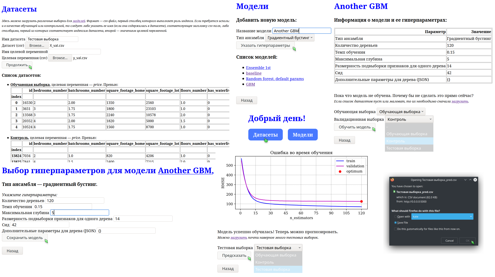

## Ансамбли решающих деревьев для решения задачи регрессии, веб-сервер

### Быстрые ссылки
* [Отчет об экспериментах](experiments/report.pdf)
* [Реализации ансамблей](ensembles/)
* [Ноутбук с экспериментами](experiments/experiments.ipynb)
* [Реализация веб-сервера](app/)
* [Формулировка задания](task/task3.pdf)

### Инструкция для [готовой сборки](https://hub.docker.com/r/artnitolog/server_ens) сервера
* `docker run --rm -p 5000:5000 -i artnitolog/server_ens`

### Команды для самостоятельной сборки 
1. `docker build -t server_ens .`
2. `docker run --rm -p 5000:5000 -i server_ens`
